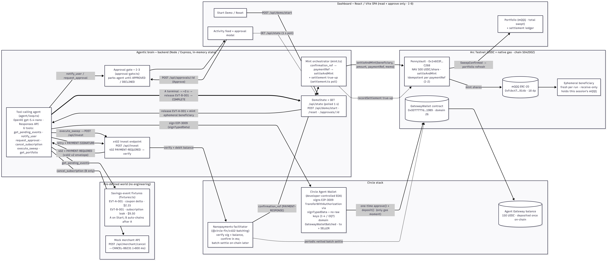

# AI PennyPicker

**An autonomous agent that invests your "found money" the second you approve it — via gas-free USDC nanopayments on Arc.**
Ignyte Stablecoin Commerce Stack Challenge · Track 4 — Best Agentic Economy Experience on Arc.

> [!IMPORTANT]
> **Live Demo Shared State:** The live demo URL points to a single, globally shared backend environment and Circle wallet. If you see unexpected events pop up or balances change while testing, other people may be interacting with the demo simultaneously!

AI PennyPicker hypothetically captures the small savings that conventional financial rails cannot economically move — a $2.15 coupon delta, a $9.50 forgotten subscription — and, on a user's approval, invests each one on-chain within seconds as fractional shares of a MOCK-tokenized-ETF100 (mQQQ), with verifiable receipts. The judge presses **Start Demo**, approves twice, and watches **$11.65** become an on-chain portfolio position backed by Circle's real payment stack.


## How this works in 30 seconds

1. Open the demo URL — one dark/light page, no login; the Gateway is pre-funded with sufficient USDC.
2. Press **Start Demo**. The agent surfaces **Event A** ("Coupon redeemed at Daily Grind Coffee… found money: $2.15. Invest it?"). Press **Approve**.
3. Watch the feed stream the rail in real time: EIP-3009 authorization signed → x402 verified → mQQQ minted on Arc, with a tx link. Portfolio: 0.0043 mQQQ, $2.15 swept.
4. **Event B** auto-fires (~3 s later): a $9.50 subscription leak — Approve; the agent cancels the subscription first, then sweeps. Portfolio: **0.0233 mQQQ, $11.65, 2 payments**.
5. Click the ArcScan link on the receipt — the session's **ephemeral beneficiary** address shows a pristine history of exactly two mints. Press **Reset** for a fresh run.


## Architecture

<table>
  <tr>
    <td valign="top" width="50%">
      <p align="center"><strong>Component Architecture</strong></p>
      <a href="docs/architecture.png" target="_blank">
        
      </a>
    </td>
    <td valign="top" width="50%">
      <p align="center"><strong>Flow Sequence</strong></p>
      <a href="docs/flow-sequence.png" target="_blank">
        
      </a>
    </td>
  </tr>
</table>

A single Start Demo trigger drives the whole system; it pauses only at the two human approval gates. The **four Circle products** appear left-to-right: **USDC** (the swept asset and Arc's native gas), **Circle Agent Wallets** (developer-controlled signer), **Circle Gateway** (the agent's unified spendable balance), and **Nanopayments** (the gas-free x402 rail).

## Two mock savings events

- **Event A — Coupon delta ($2.15):** a coupon was redeemed; the user paid $4.25 instead of $6.40. No pre-sweep action — approval goes straight to payment.
- **Event B — Subscription leak ($9.50):** a gaming subscription last used 214 days ago. The agent calls a **mock** merchant API to cancel it (`CANCEL-88231`), then sweeps the recovered amount. Total: $11.65 → 0.0233 mQQQ.

## Built on Circle Ecosystem

All integration code was written against **live Circle/Arc docs** (and, where docs were silent, verified on-chain). Wire formats, SDK signatures, and addresses were confirmed at build time, not assumed.

### USDC (the asset + the gas)
Arc's USDC is a native system contract at `0x3600000000000000000000000000000000000000` — a Circle **FiatTokenV2** exposing **EIP-3009** (`receiveWithAuthorization`), which we confirmed **on-chain** (Arc docs didn't document it). App money math is integer **micro-USDC** (6 decimals) and is never mixed with Arc's 18-decimal native-gas USDC. Code: [`backend/src/config.ts`](backend/src/config.ts), [`backend/src/payments/scripts/balances.ts`](backend/src/payments/scripts/balances.ts).

### Circle Wallets (the agent's signer)
A **developer-controlled EOA** on `ARC-TESTNET`, created with `@circle-fin/developer-controlled-wallets`. It signs the EIP-3009 `TransferWithAuthorization` via `signTypedData` — **no raw private key ever leaves Circle's MPC** (invariant I-4; our signing-probe **OQ7 = PASS**, so no key-handling exception was needed). Code: [`backend/src/payments/circle-client.ts`](backend/src/payments/circle-client.ts), [`backend/src/payments/eip3009.ts`](backend/src/payments/eip3009.ts), [`backend/src/payments/scripts/sign-probe.ts`](backend/src/payments/scripts/sign-probe.ts).

### Circle Gateway (the unified balance)
The agent makes a **one-time, on-chain** `approve()` + `deposit()` to the GatewayWallet contract (`0x0077777d7EBA4688BDeF3E311b846F25870A19B9`, domain 26) — **the last gas the agent ever pays** — turning its funds into a single spendable number (150 USDC), readable via the Gateway balance API. Code: [`backend/src/payments/gateway.ts`](backend/src/payments/gateway.ts), [`backend/src/payments/scripts/fund.ts`](backend/src/payments/scripts/fund.ts).
Deposit txs: [`approve`](https://testnet.arcscan.app/tx/0x9e58cffaf521b89536d736e7a2926a2aed23d564a452f08d5d7fdca7ed2194b3) · [`deposit`](https://testnet.arcscan.app/tx/0xadbe4451b4b89e5b5bea717545f2e4bb63843eeb4488439c9819954f5ccbd1b8).

### Nanopayments (the gas-free rail, via x402 v2)
Each sweep is an **x402** exchange over EIP-3009, settled by Circle's **Nanopayments** batching facilitator (`@circle-fin/x402-batching`): the `/api/invest` endpoint returns **402** with a base64 `PAYMENT-REQUIRED` envelope (`{ x402Version: 2, resource, accepts: [requirements] }`); the agent signs and retries with `PAYMENT-SIGNATURE`; the facilitator verifies signature + balance **off-chain in milliseconds**, returns `PAYMENT-RESPONSE` with a `confirmation_ref`, and netted-batch-settles on-chain later. The backend derives a deterministic `paymentRef` from `confirmation_ref` and calls `settleAndMint` — so a judge can hash the UI's `confirmation_ref` and match it on-chain. Code: [`backend/src/merchant/invest-route.ts`](backend/src/merchant/invest-route.ts), [`backend/src/payments/nanopayments.ts`](backend/src/payments/nanopayments.ts), [`backend/src/orchestrator/sweep-client.ts`](backend/src/orchestrator/sweep-client.ts).


### On-chain portfolio
[`PennyVault`](https://testnet.arcscan.app/address/0x14603Ff851e01E23B769226786b4F68AE97EC268) mints [`mQQQ`](https://testnet.arcscan.app/address/0xFcbc4740026896ae7DF4F019cDbcbf66FBc1914b) at a fixed mock NAV of **500 USDC/share**, **idempotent per `paymentRef`** (invariant I-2), to a fresh per-run **ephemeral beneficiary** (so every judge sees a pristine explorer view). Code: [`contracts/src/PennyVault.sol`](contracts/src/PennyVault.sol), [`contracts/src/MockQQQ.sol`](contracts/src/MockQQQ.sol).


## Local Setup & Configuration

To run the project locally, you will need to configure your environment variables and launch the dev servers.

### 1. Prerequisites (What you need)
* **OpenAI API Key** (for the agent reasoning model).
* **Circle Developer Console (Sandbox) account** (to get a Sandbox API Key and generate an Entity Secret).
* **An EVM wallet private key** (to act as the operator EOA to pay for the initial Gateway deposit and settle txs).

> [!NOTE]
> For this demo, the **Operator** (gas payer) and the **Seller** (USDC recipient) are set to the same wallet address to avoid needing to request faucet funds for two separate addresses. If you choose to use separate keys, the code supports it.

### 2. Configure Environment Variables
1. Copy `backend/.env.example` ➡️ `backend/.env` and insert your private keys/secrets. Non-secret contract addresses are already pre-filled.
2. Copy `frontend/.env.local.example` ➡️ `frontend/.env.local` to point to the local backend URL.

### 3. Initialize Wallet & Fund Gateway
Run these scripts to register your agent wallet on Circle and deposit initial liquidity:
```bash
# Install dependencies
npm install --prefix backend
npm install --prefix frontend

# Create the agent wallet and print balances
cd backend
npm run circle:create-wallet          # Generates a new wallet ID
npm run circle:balances               # Verify testnet USDC balances

# Fund the Circle Gateway contract (requires operator faucet gas/USDC)
npm run gateway:fund -- --execute
```

### 4. Run the Servers
```bash
cd backend && npm run dev      # Server runs at http://localhost:3000
cd frontend && npm run dev     # Dashboard opens in your browser
```
*(Optional: For smart contracts, compile and test via `cd contracts && forge install && forge test`)*

## Security model and known trust assumptions

Testnet demonstration scope. The trust assumptions are deliberate and disclosed:

- **Operator-attestation mint.** The backend Mint Orchestrator (an operator EOA) is the only caller of `settleAndMint` — it attests Nanopayments confirmations to the contract. This is a known centralized trust point, acceptable for the demo. The dormant `investWithAuthorization` fallback (below) removes the operator from the trust path but is not engaged.
- **Single-tier approval gate (I-3).** Every sweep and the subscription cancellation require a recorded human **APPROVED**; the agent loop parks at the gate and cannot move money on its own. Enforced in backend code (`assertEventApproved`), not in the model.
- **Unauthenticated demo-control endpoints.** `/api/demo/start`, `/api/demo/reset`, and `/api/approvals/:id` are unauthenticated — an **accepted demo-scope risk** (single-user judge demo, no accounts). The frontend has read + approve privilege only (I-9).
- **Signing path (I-4 outcome).** EIP-3009 authorizations are signed by Circle Wallets' MPC via `signTypedData`. No raw private keys are handled by the app; no key-handling exception was needed.
- **Authorization validity window.** Circle Gateway batching mandates a ~7-day minimum EIP-3009 validity (`SWEEP_AUTH_VALIDITY_SECONDS=604900`). It satisfies invariant I-5 (bounded, exact amount, fixed payee = SELLER); replay exposure is mitigated by single-use nonce + exact amount + the approval gate + a no-signature-logging rule (I-10).
- **Mocks / testnet.** mQQQ is a mock asset (not a real fund); the subscription cancellation always returns success; everything runs on Arc testnet with faucet USDC. These are disclosed, not hidden.
- **Fallback status (§10.1).** OQ6 = EIP-3009 PRESENT on Arc USDC, so the primary Nanopayments rail was used; the `investWithAuthorization` fallback is implemented and tested but **dormant** (referenced nowhere in `backend/`).


## Circle Product Feedback

**Why I chose these products.** Nanopayments is the only solution on which a **$2.15** investment is truly instant — unlike standard x402 facilitators that settle each payment individually on-chain and can only mint mQQQ safely after settlement confirmation. Because its architecture atomically deducts the payment via the Gateway's off-chain ledger at verification time, it eliminates the TOCTOU (Time-of-Check to Time-of-Use) double-spend failure risk by design. I do not have to choose between high latency and security risks. Circle **Wallets** gave the agent custody-grade signing with zero key management. **Gateway** collapsed the agent's spendable funds into a single, instantly verifiable number. And **USDC-as-gas** on Arc removed the gas-asset problem entirely (no separate native token to acquire).

**What worked well.** Circle Wallets' `signTypedData` signed the EIP-3009 `TransferWithAuthorization` cleanly on the first real attempt (after a local env fix). The Gateway `approve`+`deposit` flow and the balance API behaved exactly as documented. Arc's USDC FiatTokenV2 exposes live EIP-3009 (`receiveWithAuthorization` ran its validity check on a dummy). Arc's deterministic sub-second finality made the mint feel instant, and idempotent-per-`paymentRef` minting was trivial to reason about.

**What could be improved & production bottlenecks.**

* **Production-level Scaling Bottlenecks:**
  - **1. Gateway Deposit Gas Friction:** Depositing USDC into the Gateway requires on-chain `approve()` and `deposit()` calls, which incur network gas fees. Depositing a $2.15 savings event is offset by the gas fee. As a result, nanopayments only scale in a pre-paid/pre-funded model (e.g. user locks up $500 USDC upfront), which adds liquidity lockup friction and dampens customer adoption.
  - **2. Facilitator Interoperability:** x402 is an open protocol with multiple facilitators in the ecosystem (Coinbase, PayAI, FluxA, etc.). However, because there is no standardized cross-facilitator off-chain netting protocol, a buyer locked into Circle Gateway cannot net-settle with a merchant on Coinbase or PayAI's facilitator network without triggering a gas-expensive on-chain transaction. This fragments the agentic economy into isolated facilitator silos.
  - **3. Fiat-to-USDC Ingestion Latency:** Capturing micro-savings as they happen requires instant fiat-to-stablecoin tokenization. Standard ACH bank pulls (via Plaid or similar integrations) take **3 to 5 business days** to clear, which breaks the real-time event-driven user experience. Card rails clear instantly but carry high transaction minimums and fees (typically a flat minimum of ~$3.99 + 1.5%–3.5%), which completely eats sub-dollar sweeps. Direct wire minting via Circle Mint is restricted to institutional customers, requires high minimums, and takes 1–3 business days to clear.


## Repository layout

| Path | What |
|---|---|
| `backend/` | Node/TypeScript service (agent loop, x402 endpoint, mint orchestrator, in-memory state) → Railway |
| `frontend/` | React + Vite SPA dashboard (read + approve only) → Netlify |
| `contracts/` | Foundry: `PennyVault` + `MockQQQ` (deployed + verified on Arc testnet) |
| `docs/` | `architecture.png` |


## License & disclaimers

This project is licensed under the [MIT License](LICENSE).

Testnet demonstration for a hackathon. Not financial advice. mQQQ is a mock asset; no real securities are involved.
